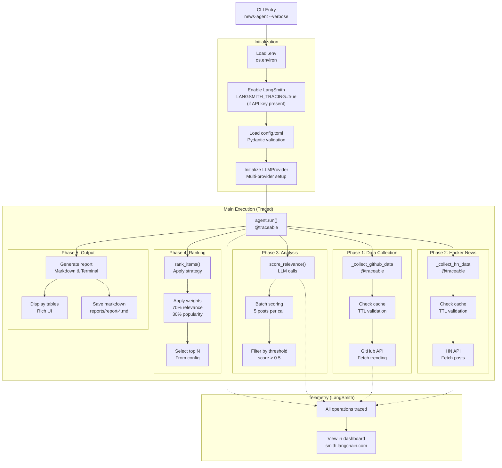

# News Agent - Developer Guide

A comprehensive guide to understanding the news-agent architecture, implementation, and LangSmith telemetry integration.

## Table of Contents

1. [Architecture Overview](#architecture-overview)
2. [System Design](#system-design)
3. [Code Organization](#code-organization)
4. [Execution Flow](#execution-flow)
5. [LangSmith Telemetry Implementation](#langsmith-telemetry-implementation)
6. [Tracing in Detail](#tracing-in-detail)
7. [Key Components](#key-components)
8. [Data Flow](#data-flow)
9. [Development Patterns](#development-patterns)

---

## Architecture Overview

The news agent is a multi-component system that orchestrates data collection, AI analysis, and reporting:


---

## System Design

### Component Interaction Diagram


### Data Flow Architecture


---

## Code Organization

### Directory Structure

```
news-agent/
├── src/news_agent/
│   ├── __main__.py              # Package entry point
│   ├── cli.py                   # Click CLI commands
│   │                             # ├─ Loads env vars
│   │                             # ├─ Enables LangSmith tracing
│   │                             # └─ Orchestrates execution
│   │
│   ├── agent/
│   │   ├── __init__.py
│   │   ├── react_agent.py       # NewsAgent (main orchestrator)
│   │   │                         # ├─ collect_github_data()
│   │   │                         # ├─ collect_hn_data()
│   │   │                         # └─ run() [root trace]
│   │   └── tools.py             # Tool registry & implementations
│   │
│   ├── llm/
│   │   └── provider.py          # LiteLLM wrapper
│   │                             # └─ complete() [LLM trace]
│   │
│   ├── analysis/
│   │   ├── relevance.py         # Relevance scoring (LLM-based)
│   │   ├── ranking.py           # Multi-strategy ranking
│   │   └── summarizer.py        # Configurable summarization
│   │
│   ├── mcp/
│   │   ├── github_client.py     # GitHub REST API client
│   │   └── hn_client.py         # Hacker News API client
│   │
│   ├── cache/
│   │   └── manager.py           # TTL-based file cache
│   │
│   ├── config/
│   │   ├── loader.py            # TOML config parsing
│   │   └── models.py            # Pydantic config models
│   │
│   ├── output/
│   │   ├── markdown.py          # Markdown report generation
│   │   └── terminal.py          # Rich terminal UI
│   │
│   └── utils/
│       └── retry.py             # Exponential backoff retry logic
│
├── tests/
│   ├── unit/                    # Unit tests (43 tests)
│   └── integration/             # Integration tests
│
├── docs/
│   ├── DEVELOPER_GUIDE.md       # This file
│   └── plans/                   # Architecture & design docs
│
├── config.toml                  # Configuration file
├── .env.example                 # Environment template
├── test_langsmith_tracing.py    # Minimal tracing test
└── Makefile                     # Development targets
```

---

## Execution Flow

### Main Execution Pipeline



### Detailed: Relevance Scoring Flow


---

## LangSmith Telemetry Implementation

### How Tracing is Enabled

#### 1. CLI Initialization (`src/news_agent/cli.py`)

```python
def run(config: Path, verbose: bool, ...):
    # Load environment variables
    load_dotenv()

    # Enable LangSmith tracing if API key is configured
    if os.getenv("LANGSMITH_API_KEY"):
        os.environ["LANGSMITH_TRACING"] = "true"

    # ... rest of initialization
```

**Why this works:**
- `LANGSMITH_TRACING=true` is the official LangSmith environment variable
- When set, LangSmith SDK automatically:
  - Creates trace context for all `@traceable` decorated functions
  - Records all LLM calls via LiteLLM callbacks
  - Persists traces to the configured project

#### 2. Agent Decoration (`src/news_agent/agent/react_agent.py`)

```python
from langsmith import traceable

class NewsAgent:
    @traceable(name="news_agent_run")
    def run(self, no_cache: bool = False) -> dict[str, Any]:
        """Root trace for entire agent execution"""
        # ... main workflow

    @traceable(name="collect_github_data")
    def _collect_github_data(self, no_cache: bool) -> list[dict[str, Any]]:
        """GitHub collection phase"""
        # ... GitHub collection logic

    @traceable(name="collect_hn_data")
    def _collect_hn_data(self, no_cache: bool) -> list[dict[str, Any]]:
        """Hacker News collection phase"""
        # ... HN collection logic
```

**Trace Names:**
- `news_agent_run` - Root trace, captures entire execution
- `collect_github_data` - GitHub API phase
- `collect_hn_data` - Hacker News API phase

#### 3. LLM Integration (`src/news_agent/llm/provider.py`)

```python
from langsmith import traceable

class LLMProvider:
    @traceable(name="llm_complete")
    def complete(self, messages: List[Dict[str, Any]], ...) -> str:
        """LLM completion with automatic tracing"""
        response = completion(
            model=self.model,
            messages=messages,
            temperature=temperature,
            max_tokens=max_tokens,
            api_key=self._api_key,
            **kwargs
        )
        return response.choices[0].message.content
```

**Why this works:**
- LiteLLM detects active LangSmith trace context
- Automatically sends completion details to LangSmith via callback
- Includes: prompt, response, tokens, model, latency

---

## Tracing in Detail

### Trace Hierarchy


### Trace Content for Each Span

#### Root Trace: `news_agent_run`

```json
{
  "name": "news_agent_run",
  "status": "success",
  "start_time": "2025-11-16T10:19:28Z",
  "end_time": "2025-11-16T10:21:13Z",
  "duration_ms": 105000,
  "inputs": {
    "no_cache": false
  },
  "outputs": {
    "github_repos": 25,
    "hn_posts": 16,
    "sources": ["github", "hackernews"]
  }
}
```

#### Phase Trace: `collect_github_data`

```json
{
  "name": "collect_github_data",
  "status": "success",
  "duration_ms": 1240,
  "inputs": {
    "no_cache": false
  },
  "outputs": {
    "count": 25,
    "data": [
      {
        "name": "repo-name",
        "stars": 153,
        "description": "Repository description"
      }
    ]
  }
}
```

#### LLM Call Trace: `llm_complete`

```json
{
  "name": "llm_complete",
  "status": "success",
  "duration_ms": 4500,
  "inputs": {
    "messages": [
      {
        "role": "system",
        "content": "Score relevance of posts..."
      },
      {
        "role": "user",
        "content": "Posts: 1. Post Title...\n2. Post Title..."
      }
    ],
    "model": "anthropic/claude-3.5-sonnet",
    "temperature": 0.7,
    "max_tokens": 1024
  },
  "outputs": {
    "response": "{\"scores\": [0.8, 0.9, 0.7, ...]}"
  },
  "metadata": {
    "tokens_used": {
      "prompt": 267,
      "completion": 217,
      "total": 484
    },
    "model": "claude-3.5-sonnet",
    "provider": "openrouter",
    "latency_ms": 4500
  }
}
```

---

## Key Components

### 1. NewsAgent (`src/news_agent/agent/react_agent.py`)

The main orchestrator using ReACT (Reasoning + Acting) pattern:


**Key Methods:**
- `run()` - Main execution loop (traced)
- `_collect_github_data()` - GitHub data collection (traced)
- `_collect_hn_data()` - HN data collection (traced)
- Uses `ToolRegistry` to call specialized tools

### 2. LLMProvider (`src/news_agent/llm/provider.py`)

Multi-provider LLM wrapper using LiteLLM:

```python
class LLMProvider:
    def __init__(self, config: LLMConfig):
        self.config = config
        self.model = config.model
        # Validates provider
        # Loads API key
        # Configures LangSmith if available

    @traceable(name="llm_complete")
    def complete(self, messages, temperature, max_tokens, **kwargs) -> str:
        """Single LLM completion with tracing"""
        # Calls LiteLLM
        # Validates response
        # Logs token usage
        # Returns response text
```

**Providers Supported:**
- Anthropic (Claude)
- OpenAI (GPT)
- OpenRouter (Multi-model)
- Azure, Bedrock, Cohere, Ollama

### 3. Data Clients

#### GitHub Client (`src/news_agent/mcp/github_client.py`)

```python
def fetch_trending_repos(self, no_cache: bool) -> dict:
    """
    Fetches trending repositories using GitHub Search API

    Query: created:>{date} stars:>50
    Returns: Up to 25 repositories sorted by stars
    """
```

#### Hacker News Client (`src/news_agent/mcp/hn_client.py`)

```python
def fetch_posts(self, endpoint: str, no_cache: bool) -> dict:
    """
    Fetches HN posts via Firebase API

    Endpoints: "newest", "show" (Show HN posts)
    Uses parallel fetching: asyncio.gather() for ~10x speedup
    """
```

### 4. Relevance Scorer (`src/news_agent/analysis/relevance.py`)

Uses LLM to score posts for relevance to configured topics:

```python
def score(self, items: List[dict], topics: List[str]) -> List[dict]:
    """
    Scores items for relevance using LLM

    Process:
    1. Batch items (5 per batch)
    2. Create scoring prompt with topics
    3. Call LLM for each batch
    4. Parse JSON responses
    5. Merge results
    6. Filter by threshold (> 0.5)

    Returns items with relevance_score field
    """
```

### 5. Ranker (`src/news_agent/analysis/ranking.py`)

Multi-strategy ranking system:


---

## Data Flow

### GitHub Collection Flow


### Hacker News Collection Flow


---

## Development Patterns

### 1. Test-Driven Development (TDD)

All features follow RED-GREEN-REFACTOR cycle:


### 2. Code Organization Pattern

```
Feature Implementation:
├── Write test (tests/unit/test_feature.py)
├── Watch fail
├── Implement minimal code (src/news_agent/...)
├── Watch pass
├── Refactor for quality
├── Code review via agent
└── Commit with message
```

### 3. Error Handling Pattern

```python
try:
    result = api_call()
except SpecificError as e:
    log_error()
    retry_with_backoff()
except Exception as e:
    graceful_degradation()
    continue_with_defaults()
```

### 4. Telemetry Pattern

All user-facing operations should:

1. Be decorated with `@traceable(name="operation_name")`
2. Input/output logged automatically
3. LLM calls traced via LiteLLM
4. Metrics visible in LangSmith dashboard

---

## Quick Reference: Adding New Features

### Adding a New Data Source

1. **Create API client** in `src/news_agent/mcp/source_client.py`
   ```python
   def fetch_data(self, no_cache: bool) -> dict:
       # Implement fetching logic
       # Use cache manager
       # Return structured data
   ```

2. **Add to Tool Registry** in `src/news_agent/agent/tools.py`
   ```python
   self.tools["fetch_new_source"] = self.source_client.fetch_data
   ```

3. **Add to Agent** in `src/news_agent/agent/react_agent.py`
   ```python
   @traceable(name="collect_new_source")
   def _collect_new_source(self, no_cache: bool) -> list:
       # Call tool
       # Process data
       return data
   ```

4. **Add to Configuration** in `config.toml`
   ```toml
   [sources.newsource]
   enabled = true
   endpoints = [...]
   ```

### Adding LangSmith Tracing to a Function

1. **Import decorator**
   ```python
   from langsmith import traceable
   ```

2. **Decorate function**
   ```python
   @traceable(name="my_operation")
   def my_operation(self, param1: str) -> str:
       # Function implementation
       return result
   ```

3. **Check trace in LangSmith**
   - Run agent: `news-agent --verbose`
   - Visit: `smith.langchain.com`
   - View trace in project: `news-agent`

---

## Troubleshooting Telemetry

### Traces Not Appearing in LangSmith

**Checklist:**
1. ✅ `LANGSMITH_API_KEY` set in `.env`
2. ✅ API key is valid (check via web UI)
3. ✅ `LANGSMITH_TRACING=true` enabled (set automatically by CLI)
4. ✅ Function decorated with `@traceable`
5. ✅ LLM calls made during execution
6. ✅ Project name matches: `LANGSMITH_PROJECT=news-agent`

**Debug Steps:**
```bash
# Test minimal tracing
python3 test_langsmith_tracing.py

# Check environment
echo $LANGSMITH_API_KEY
echo $LANGSMITH_PROJECT

# Run with verbose logging
news-agent --verbose

# Check LLM logs for "success_handler" confirmation
news-agent --verbose 2>&1 | grep "success_handler"
```

### LLM Traces Show No Token Data

**Cause:** LiteLLM wrapper not properly capturing response

**Solution:**
- Ensure `completion()` call returns proper OpenAI format response
- Check response has `.usage.prompt_tokens` field
- Verify model provides token counts

---

## Understanding the Codebase

### Reading Order for New Developers

1. **Start here:** `src/news_agent/cli.py`
   - Entry point
   - Configuration loading
   - Telemetry enablement

2. **Then:** `src/news_agent/agent/react_agent.py`
   - Main orchestration logic
   - Phase separation
   - Tool invocation pattern

3. **Then:** `src/news_agent/llm/provider.py`
   - LLM integration
   - Multi-provider support
   - Tracing setup

4. **Then:** Data clients
   - `src/news_agent/mcp/github_client.py`
   - `src/news_agent/mcp/hn_client.py`

5. **Finally:** Analysis
   - `src/news_agent/analysis/relevance.py`
   - `src/news_agent/analysis/ranking.py`

### Key Files by Purpose

| Purpose | File | Key Class/Function |
|---------|------|-------------------|
| Entry point | `cli.py` | `run()` command |
| Orchestration | `agent/react_agent.py` | `NewsAgent.run()` |
| LLM integration | `llm/provider.py` | `LLMProvider.complete()` |
| GitHub fetching | `mcp/github_client.py` | `fetch_trending_repos()` |
| HN fetching | `mcp/hn_client.py` | `fetch_posts()` |
| Relevance scoring | `analysis/relevance.py` | `RelevanceScorer.score()` |
| Ranking | `analysis/ranking.py` | `Ranker.rank()` |
| Caching | `cache/manager.py` | `CacheManager` |
| Configuration | `config/models.py` | Pydantic models |
| Output | `output/markdown.py` | `MarkdownGenerator` |
| Telemetry | `cli.py` | LANGSMITH_TRACING env var |

---

## Performance Considerations

### Execution Timeline (Typical Run)


### Optimization Opportunities

1. **Parallel batching**: HN fetches use `asyncio.gather()` - ~10x speedup
2. **Caching**: TTL-based caching reduces redundant API calls
3. **Batch scoring**: Groups posts into batches - reduces LLM calls from 29 to 6
4. **Exponential backoff**: Retries with increasing delays for transient failures

---

## Contributing Guidelines

### Code Review Criteria

- ✅ Tests written first (TDD)
- ✅ All tests passing
- ✅ Code follows project patterns
- ✅ Error handling present
- ✅ Logging added for debuggability
- ✅ Telemetry/tracing considered
- ✅ Documentation updated

### Commit Message Format

```
<type>: <brief description>

<longer explanation if needed>

Related to: <issue number or feature>
```

**Types:** feat, fix, refactor, docs, test, chore

---

## Resources

- **LangSmith Docs**: https://docs.langsmith.com/
- **LiteLLM Docs**: https://docs.litellm.ai/
- **GitHub API**: https://docs.github.com/en/rest
- **HN API**: https://github.com/HackerNews/API
- **Pydantic**: https://pydantic.dev/
- **Click CLI**: https://click.palletsprojects.com/
- **Rich**: https://rich.readthedocs.io/

---

**Last Updated:** November 16, 2025
**Maintained By:** Development Team
