# Developer Notes

Complete guide to understanding, modifying, and contributing to the news-agent project.

## Table of Contents

1. [Overview](#overview)
2. [Architecture](#architecture)
3. [How It Works](#how-it-works)
4. [Key Components](#key-components)
5. [Data Flow](#data-flow)
6. [LangSmith Telemetry](#langsmith-telemetry)
7. [Project Structure](#project-structure)
8. [Development Setup](#development-setup)
9. [Testing](#testing)
10. [Contributing](#contributing)

---

## Overview

News Agent is an AI-powered news aggregation tool that:
- Fetches trending content from GitHub and Hacker News
- Uses Claude to analyze and score relevance
- Ranks results by relevance and popularity
- Generates markdown reports with results
- Caches results to avoid redundant API calls

### Tech Stack

- **Language**: Python 3.11+
- **CLI Framework**: Click
- **LLM Integration**: LiteLLM (multi-provider support)
- **Data Validation**: Pydantic
- **Terminal UI**: Rich
- **Configuration**: TOML
- **Telemetry**: LangSmith
- **Testing**: pytest
- **Type Checking**: mypy

### Key Design Principles

1. **ReACT Agent Pattern**: Orchestrates data collection, analysis, and ranking
2. **Modular Components**: Loosely coupled, independently testable
3. **Configuration-Driven**: TOML config for runtime behavior
4. **Error Resilience**: Graceful degradation with fallbacks
5. **Observability**: Complete LangSmith tracing for debugging
6. **Test-Driven**: 43+ unit tests, 2 integration tests

---

## Architecture

### System Design

```mermaid
graph TD
    CLI["📋 News Agent CLI"]
    AGENT["🤖 ReACT Agent"]
    GH["🔗 GitHub Client"]
    HN["📰 Hacker News Client"]
    SCORER["🎯 Relevance Scorer"]
    RANKER["📊 Ranker"]
    OUTPUT["📄 Output"]

    CLI --> AGENT
    AGENT --> GH
    AGENT --> HN
    AGENT --> SCORER
    GH --> RANKER
    HN --> RANKER
    SCORER --> RANKER
    RANKER --> OUTPUT

    style CLI fill:#e1f5ff
    style AGENT fill:#f3e5f5
    style GH fill:#e8f5e9
    style HN fill:#e8f5e9
    style SCORER fill:#fff3e0
    style RANKER fill:#fce4ec
    style OUTPUT fill:#f1f8e9
```



### Component Breakdown

```
src/news_agent/
├── cli.py                 # CLI entry point, orchestration
├── agent/
│   ├── react_agent.py     # Main agent, workflow orchestration
│   └── tools.py           # Tool definitions for agent
├── analysis/
│   ├── relevance.py       # LLM-based relevance scoring
│   ├── summarization.py   # Summary generation for content
│   └── ranking.py         # Ranking by popularity/relevance
├── mcp/
│   ├── github_client.py   # GitHub API wrapper
│   ├── hn_client.py       # Hacker News API wrapper
│   └── models.py          # Data models for API responses
├── cache/
│   └── manager.py         # TTL-based caching
├── config/
│   ├── loader.py          # TOML config loading
│   └── models.py          # Pydantic config schemas
├── llm/
│   └── provider.py        # LiteLLM wrapper for multi-provider support
├── output/
│   ├── markdown.py        # Markdown report generation
│   └── terminal.py        # Rich terminal UI
└── utils/
    └── retry.py           # Exponential backoff retry logic
```

---

## How It Works

### Execution Flow (5 Steps)

#### Step 1: Load & Validate Configuration
```
CLI entry → Load config.toml → Validate with Pydantic → Apply CLI overrides
```
- Configuration loaded from `config.toml`
- Environment variables override config
- CLI flags override everything

#### Step 2: Initialize Components
```
Create LLM Provider → Create Cache Manager → Create Data Clients → Create Scorers
```
- LiteLLM provider initialized (selects from Anthropic, OpenAI, etc.)
- Cache manager ready for TTL-based caching
- GitHub and Hacker News clients ready
- Relevance scorer prepared

#### Step 3: Collect Data (with caching & retry)
```
GitHub Trending → Cache lookup → API call (if needed) → Process results
HN Posts → Cache lookup → API call (if needed) → Filter by topic
```
- **GitHub**: Fetches trending repos, caches for TTL
- **HN**: Fetches top posts, filters for AI/ML topics
- Exponential backoff retry on failures
- Graceful degradation if data source fails

#### Step 4: Analyze & Rank
```
Batch scoring via LLM → Score each item 0-10 → Apply ranking strategy
```
- Score github repos for AI/ML relevance
- Score HN posts for relevance
- Combine popularity (stars/score) with relevance
- Rank by weighted strategy (popularity/relevance/balanced)

#### Step 5: Generate Output
```
Format markdown report → Display terminal preview → Save to file
```
- Pretty tables with top results
- Markdown report with details
- Summary statistics

### Data Collection Details

#### GitHub Data Flow

```mermaid
graph LR
    API["🔌 GitHub API<br/>REST v3"]
    SEARCH["🔍 Search Trending<br/>by language"]
    EXTRACT["📦 Extract Data<br/>stars, forks, etc"]
    CACHE["💾 Cache<br/>TTL: 1 hour"]
    RETURN["✅ Return<br/>~25 repos"]

    API --> SEARCH
    SEARCH --> EXTRACT
    EXTRACT --> CACHE
    CACHE --> RETURN

    style API fill:#e8f5e9
    style SEARCH fill:#c8e6c9
    style EXTRACT fill:#a5d6a7
    style CACHE fill:#81c784
    style RETURN fill:#66bb6a
```



**What we fetch:**
- Repository name, URL, description
- Star count (popularity metric)
- Fork count, language
- Last update time

**Filtering:** Language-based (software repos only)

#### Hacker News Data Flow

```mermaid
graph LR
    API["🔥 HN Firebase API"]
    FETCH["📥 Fetch Posts<br/>top/newest/show"]
    FILTER["🎯 Filter Topics<br/>AI, ML, GenAI, LLM"]
    CACHE["💾 Cache<br/>TTL: 1 hour"]
    RETURN["✅ Return<br/>filtered posts"]

    API --> FETCH
    FETCH --> FILTER
    FILTER --> CACHE
    CACHE --> RETURN

    style API fill:#fff3e0
    style FETCH fill:#ffe0b2
    style FILTER fill:#ffcc80
    style CACHE fill:#ffb74d
    style RETURN fill:#ffa726
```



**What we fetch:**
- Post title, URL, author
- Score (upvotes), comment count
- Post type (story, poll, job, etc.)

**Filtering:** Topic-based keywords in title

### Relevance Scoring Process

```mermaid
graph LR
    BATCH["📦 Batch of 5<br/>items"]
    PROMPT["💭 LLM Prompt<br/>Rate 0-10"]
    PARSE["🔍 Parse<br/>response"]
    SCORE["⭐ Score<br/>0-10"]
    STORE["💾 Store with<br/>metadata"]
    CHECK{"All items<br/>scored?"}
    NEXT["➡️ Next batch"]
    DONE["✅ Done"]

    BATCH --> PROMPT
    PROMPT --> PARSE
    PARSE --> SCORE
    SCORE --> STORE
    STORE --> CHECK
    CHECK -->|No| NEXT
    NEXT --> BATCH
    CHECK -->|Yes| DONE

    style BATCH fill:#f3e5f5
    style PROMPT fill:#e1bee7
    style PARSE fill:#ce93d8
    style SCORE fill:#ba68c8
    style STORE fill:#ab47bc
    style CHECK fill:#9c27b0
    style NEXT fill:#ba68c8
    style DONE fill:#66bb6a
```



**Scoring Batches:**
- Default batch size: 5 items per API call
- Reduces LLM API costs vs. scoring individually
- Parallel scoring across multiple batches

**Ranking Strategies:**
1. **Popularity**: Sort by stars/votes only
2. **Relevance**: Sort by LLM score only
3. **Balanced** (default): `0.7 × relevance + 0.3 × popularity`

---

## Key Components

### 1. ReACT Agent (src/news_agent/agent/react_agent.py)

**Purpose**: Orchestrates the complete workflow using the ReACT pattern (Reasoning + Acting)

#### The ReACT Pattern

ReACT is a foundational agent design paradigm that separates agent logic into two interleaved phases:

1. **Reasoning (R)**: The agent thinks about what to do next
2. **Acting (A)**: The agent executes the selected action via tools

**Why ReACT?**
- ✅ **Transparent**: Every decision is reasoned before execution
- ✅ **Interpretable**: See why the agent made each choice (in traces)
- ✅ **Recoverable**: Failed actions can be recovered from
- ✅ **Composable**: New tools can be added without changing agent logic

#### Current Implementation

The news-agent uses a **structured ReACT workflow** with predetermined phases:

```mermaid
graph LR
    INIT["🔧 Initialize"]
    R1["🧠 Reason:<br/>Which sources<br/>enabled?"]
    A1["🔨 Act:<br/>Fetch data<br/>from sources"]
    R2["🧠 Reason:<br/>Which items<br/>relevant?"]
    A2["🔨 Act:<br/>Score &<br/>rank items"]
    OUTPUT["📄 Output"]

    INIT --> R1
    R1 --> A1
    A1 --> R2
    R2 --> A2
    A2 --> OUTPUT

    style R1 fill:#fff9c4
    style R2 fill:#fff9c4
    style A1 fill:#c8e6c9
    style A2 fill:#c8e6c9
    style INIT fill:#e1f5ff
    style OUTPUT fill:#fce4ec
```



**Key Methods:**
- `run()`: Main orchestrator, implements ReACT loop
  - Reasoning: "Which sources are enabled?"
  - Acting: Call data collection tools
  - Reasoning: "What's relevant?"
  - Acting: Call scoring/ranking tools

- `_collect_github_data()`: Execute GitHub data collection tool
  - Calls `fetch_github_trending()` from tool registry
  - Applies result processing

- `_collect_hn_data()`: Execute HN data collection tool
  - Calls `fetch_hn_posts()` then `score_relevance()` from tool registry
  - Chains tool results together

#### Tool Registry Pattern

Tools are registered as callable functions with standardized signatures:

```python
class ToolRegistry:
    def _register_tools(self) -> dict[str, Callable]:
        return {
            "fetch_github_trending": self._fetch_github_trending,  # → API call
            "fetch_hn_posts": self._fetch_hn_posts,                # → API call
            "score_relevance": self._score_relevance,              # → LLM call
            "rank_items": self._rank_items,                        # → Ranking
        }

# Agent uses tools via:
result = self.tools.tools["fetch_github_trending"](no_cache=True)
```

Each tool returns `{"source": "...", "data": [...]}` for consistency.

#### Types of Reasoning in the Agent

**Type 1: Configuration-Based Reasoning** (deterministic)
```python
# Agent thinks: "Is GitHub source enabled in config?"
if self.config.sources.github.enabled:
    github_data = self._collect_github_data(no_cache)
```

**Type 2: LLM-Based Reasoning** (stochastic, via tools)
```python
# Agent asks LLM: "How relevant is this post to AI/ML?"
scored_posts = self.tools.tools["score_relevance"](posts, topics)
# LLM returns relevance scores 0-10 for each post
```

**Tracing:**
- Root trace: `news_agent_run` - entire ReACT workflow
- Phase traces: `collect_github_data`, `collect_hn_data` - reasoning+acting pairs
- Tool traces: `score_relevance` - LLM-based reasoning
- Output traces: `rank_items` - action execution

---

### Claude Agent SDK Integration

#### Current Status

The news-agent architecture is **ready for Claude Agent SDK integration**. Currently uses manual ReACT implementation. The TODO comment in code marks the integration point:

```python
# In src/news_agent/agent/react_agent.py, line 24:
# TODO: Initialize Claude Agent SDK client
# This will use the SDK's MCP integration
```

#### Why Claude Agent SDK?

The SDK provides **first-class support** for the agent patterns we're manually implementing:

1. **Standardized Tool Definitions** - JSON schema-based tool registration
2. **MCP Integration** - Native Model Context Protocol for extending capabilities
3. **Tool Loop Management** - Automatic handling of tool invocation loop
4. **Extended Thinking** - Support for multi-step reasoning
5. **Built-in Error Handling** - Standardized recovery from tool failures
6. **Automatic Tracing** - Native integration with observability platforms

#### Migration Path

**Phase 1: Today (Current State)**
- Manual ReACT implementation
- Tool Registry pattern (custom)
- LiteLLM for provider abstraction
- LangSmith for observability

```python
# News Agent orchestrates manually
agent = NewsAgent(config, tool_registry, llm_provider)
results = agent.run()  # Manual control flow
```

**Phase 2: Agent SDK Integration (Next)**
- Replace manual ReACT with SDK tool-use loop
- Convert ToolRegistry to SDK tool definitions
- Leverage SDK's built-in reasoning capabilities

```python
# Future: Using Claude Agent SDK
from anthropic import Anthropic

client = Anthropic()
tools = [
    {
        "name": "fetch_github_trending",
        "description": "Fetch trending GitHub repositories",
        "input_schema": {
            "type": "object",
            "properties": {
                "time_range": {"type": "string", "enum": ["daily", "weekly", "monthly"]}
            }
        }
    },
    {
        "name": "fetch_hn_posts",
        "description": "Fetch Hacker News posts by endpoint",
        "input_schema": {
            "type": "object",
            "properties": {
                "endpoint": {"type": "string", "enum": ["newest", "top", "show"]}
            }
        }
    },
    # ... more tools
]

# SDK handles the reasoning + tool-use loop
messages = [
    {
        "role": "user",
        "content": "Aggregate and analyze trending content from GitHub and Hacker News"
    }
]

response = client.messages.create(
    model="claude-3-5-sonnet-20241022",
    max_tokens=4096,
    tools=tools,
    messages=messages
)

# SDK automatically handles:
# 1. Agent reasoning about which tool to call
# 2. Tool invocation with user-provided handlers
# 3. Response parsing and continuation
# 4. Multi-turn tool loops until completion
```

**Phase 3: Full MCP Integration (Future)**
- Connect to official GitHub MCP server
- Connect to official Hacker News MCP server
- Dynamic tool discovery and loading

```python
# No need for manual GitHub/HN clients
# MCP servers provide tools directly to SDK
```

#### Tool Registry → SDK Tool Mapping

**Current Tool Registry:**
```python
{
    "fetch_github_trending": func,     # Returns ~25 repos
    "fetch_hn_posts": func,             # Returns ~100 posts
    "score_relevance": func,            # Adds scores via LLM
    "rank_items": func,                 # Ranks by strategy
}
```

**Will become SDK Tools:**
```python
[
    {
        "name": "fetch_github_trending",
        "description": "Fetch trending GitHub repos with optional filtering",
        "input_schema": {
            "type": "object",
            "properties": {
                "time_range": {
                    "type": "string",
                    "enum": ["daily", "weekly", "monthly"],
                    "description": "Time window for trends"
                },
                "language_filter": {
                    "type": "string",
                    "description": "Optional language filter (Python, Rust, etc)"
                }
            },
            "required": ["time_range"]
        }
    },
    # ... more tool definitions with full schema
]

# SDK automatically:
# - Validates inputs against schema before calling
# - Calls your handler function with validated inputs
# - Manages the tool-use loop
# - Retries on errors with backoff
# - Streams results back to agent reasoning
```

#### Integration Benefits

**For ReACT Pattern:**
- SDK implements the tool-use loop → no manual loop control
- Agent focuses purely on business logic
- Cleaner separation of reasoning from orchestration

**For Code Quality:**
- Fewer lines of orchestration code
- Less state management (SDK handles it)
- Standardized error recovery

**For Debugging:**
- Built-in trace context for each tool call
- Automatic logging of tool inputs/outputs
- Native integration with LangSmith/OpenTelemetry

**For Extensibility:**
- Add tools by defining JSON schema + handler function
- No changes to agent orchestration code
- Tools can be dynamic (loaded at runtime via MCP)

#### Code Locations for SDK Integration

1. **src/news_agent/agent/react_agent.py** (line 24)
   - Initialize `Anthropic()` client
   - Define tools with JSON schemas
   - Implement tool use loop

2. **src/news_agent/agent/tools.py**
   - Convert ToolRegistry to SDK tool definitions
   - Keep handler functions as-is (slight signature updates)

3. **src/news_agent/llm/provider.py**
   - Can be simplified (SDK handles provider selection)
   - Or kept for multi-provider support via SDK

4. **src/news_agent/mcp/** (future)
   - Replace with MCP client integration
   - Load GitHub/HN servers dynamically

---

### 2. LLM Provider (src/news_agent/llm/provider.py)

**Purpose**: Multi-provider LLM abstraction using LiteLLM

**Key Methods:**
- `complete()`: Send prompt, get completion
- Supports 100+ LLM providers (Anthropic, OpenAI, Ollama, etc.)

**Configuration:**
```toml
[llm]
provider = "anthropic"
model = "claude-3-5-sonnet-20241022"
api_key_env = "ANTHROPIC_API_KEY"
```

**Tracing:**
- Wrapped by LiteLLM callbacks automatically
- Records: prompts, completions, token counts, latency

### 3. Relevance Scorer (src/news_agent/analysis/relevance.py)

**Purpose**: Uses LLM to score content relevance

**Algorithm:**
1. Batch items (5 at a time)
2. Create prompt asking LLM to rate each 0-10
3. Parse response, extract scores
4. Retry on parse failures with backoff

**Example Prompt:**
```
Rate the relevance of each item to AI/ML on a scale of 0-10.
Return scores as: Item: {item_title} = {score}

Items:
1. New Transformer Architecture...
2. JavaScript UI Library...
3. LLM Fine-tuning Guide...
```

**Configuration:**
```python
analysis:
  depth: "medium"  # Affects prompt style
  top_n: 25        # Keep top 25 items
```

### 4. Cache Manager (src/news_agent/cache/manager.py)

**Purpose**: TTL-based file caching

**Storage:** `.cache/news-agent/` directory

**Key Features:**
- Automatic expiration (default 1 hour)
- Per-source caching (github, hackernews separate)
- Manual invalidation with `--no-cache`

**Usage in Code:**
```python
cache_key = "github_trending_2025-11-16"
cached_data = cache.get(cache_key)

if cached_data:
    return cached_data

# Fetch fresh data
data = fetch_from_api()
cache.set(cache_key, data, ttl_hours=1)
return data
```

### 5. Configuration System (src/news_agent/config/)

**Purpose**: TOML-based configuration with Pydantic validation

**Files:**
- `loader.py`: Loads and merges config sources
- `models.py`: Pydantic schemas for validation

**Config Hierarchy** (lowest to highest priority):
1. Default values in Pydantic models
2. config.toml file
3. Environment variables
4. CLI flags

**Main Sections:**
```toml
[llm]              # LLM provider settings
[analysis]         # Depth and filtering
[sources.github]   # GitHub API settings
[sources.hackernews] # HN API settings
[ranking]          # Ranking strategy and weights
[caching]          # Cache TTL settings
[output]           # Output format and path
[retry]            # Retry behavior
[telemetry]        # LangSmith configuration
```

---

## Data Flow

### Complete Request Flow

```mermaid
graph TD
    INPUT["📥 User Command<br/>news-agent --depth deep"]
    CONFIG["⚙️ Load & Validate<br/>config.toml"]
    INIT["🔧 Initialize<br/>Components"]
    GH["🔗 GitHub API<br/>~25 repos"]
    HN["📰 HN API<br/>~100 posts"]
    COLLECT["📦 Collect Data<br/>Parallel"]
    FILTER["🎯 Filter & Process<br/>Dedup, Validate"]
    SCORE["⭐ Score Relevance<br/>via LLM"]
    RANK["📊 Rank Items<br/>Apply strategy"]
    FORMAT["📄 Format Output<br/>Tables & MD"]
    SAVE["💾 Save Report<br/>reports/"]

    INPUT --> CONFIG
    CONFIG --> INIT
    INIT --> GH
    INIT --> HN
    GH --> COLLECT
    HN --> COLLECT
    COLLECT --> FILTER
    FILTER --> SCORE
    SCORE --> RANK
    RANK --> FORMAT
    FORMAT --> SAVE

    style INPUT fill:#e1f5ff
    style CONFIG fill:#b3e5fc
    style INIT fill:#81d4fa
    style GH fill:#e8f5e9
    style HN fill:#fff3e0
    style COLLECT fill:#f3e5f5
    style FILTER fill:#e1bee7
    style SCORE fill:#ce93d8
    style RANK fill:#ba68c8
    style FORMAT fill:#fce4ec
    style SAVE fill:#66bb6a
```



### Trace Hierarchy in LangSmith

When telemetry is enabled (`LANGSMITH_API_KEY` set), the complete execution is traced:

```mermaid
graph TD
    ROOT["📊 news_agent_run<br/>Root Trace"]
    GH["🔗 collect_github_data<br/>Phase 1"]
    HN["📰 collect_hn_data<br/>Phase 2"]
    SCORE["⭐ score_relevance<br/>Phase 3"]
    LLM1["🤖 llm_complete<br/>Call 1: Score repos"]
    LLM2["🤖 llm_complete<br/>Call 2: Score posts"]
    RANK["📊 rank_items<br/>Phase 4"]

    ROOT --> GH
    ROOT --> HN
    ROOT --> SCORE
    ROOT --> RANK
    SCORE --> LLM1
    SCORE --> LLM2

    style ROOT fill:#e3f2fd
    style GH fill:#c8e6c9
    style HN fill:#fff3e0
    style SCORE fill:#f3e5f5
    style LLM1 fill:#e1bee7
    style LLM2 fill:#e1bee7
    style RANK fill:#fce4ec
```



**What's Captured:**
- Function execution time
- Input parameters and outputs
- Token usage (input, output, total)
- Model and provider used
- Errors and stack traces
- API latency

---

## LangSmith Telemetry

### How It Works

1. **Activation**: Set `LANGSMITH_API_KEY` in `.env`
2. **Automatic Detection**: CLI checks for API key
3. **Environment Configuration**: If key present, sets `LANGSMITH_TRACING=true`
4. **LangSmith Registration**: Automatically registers traces
5. **Viewing**: Traces appear in https://smith.langchain.com/

### Setup

```bash
# 1. Get API key from https://smith.langchain.com/
# 2. Add to .env
LANGSMITH_API_KEY=your_api_key_here

# 3. Run agent - traces happen automatically
news-agent --verbose
```

### Code Implementation

**In src/news_agent/cli.py:**
```python
# Enable LangSmith tracing if API key is configured
if os.getenv("LANGSMITH_API_KEY"):
    os.environ["LANGSMITH_TRACING"] = "true"
```

**In src/news_agent/agent/react_agent.py:**
```python
@traceable(name="news_agent_run")
def run(self, no_cache: bool = False) -> Dict[str, Any]:
    # Main workflow
    ...

@traceable(name="collect_github_data")
def _collect_github_data(self) -> List[GitHubRepo]:
    # GitHub collection
    ...
```

**LiteLLM Integration:**
LiteLLM automatically wraps all completions with LangSmith callbacks when `LANGSMITH_TRACING` is true. Each LLM call is recorded as:
- Function name: `llm_complete`
- Inputs: prompt, model, parameters
- Outputs: completion text
- Metadata: tokens, latency, cost

### Debugging Traces

**Check if tracing is enabled:**
```bash
# Look for LangSmith debug output
news-agent --verbose 2>&1 | grep -i "langsmith\|tracing"
```

**Dashboard Navigation:**
1. Go to https://smith.langchain.com/
2. Select "news-agent" project
3. View runs in chronological order
4. Click on run to see trace hierarchy
5. Click on spans to see inputs/outputs

**Common Issues:**

| Issue | Cause | Solution |
|-------|-------|----------|
| No traces appear | API key not set | Set `LANGSMITH_API_KEY` in `.env` |
| Old traces visible | Wrong project | Check `LANGSMITH_PROJECT` env var |
| Spans missing | Function not decorated | Add `@traceable` decorator |
| No LLM calls | LiteLLM callback not registered | Ensure `LANGSMITH_TRACING=true` |

### Performance Impact

**Tracing Overhead:** ~7% additional latency
- Network calls to LangSmith (async)
- Minimal impact on main execution
- Can be disabled if needed: `telemetry.enabled = false` in config

---

## Project Structure

### Directory Layout

```
news-agent/
├── README.md                 # User-facing documentation
├── docs/
│   └── DEVELOPER_NOTES.md   # This file
├── config.toml              # Main configuration file
├── .env.example             # Environment template
├── pyproject.toml           # Python project config
├── Makefile                 # Build targets
├── src/news_agent/
│   ├── __init__.py
│   ├── __main__.py          # Module entry point
│   ├── cli.py               # CLI command
│   ├── agent/
│   │   ├── __init__.py
│   │   ├── react_agent.py   # Main orchestration
│   │   └── tools.py         # Tool definitions
│   ├── analysis/
│   │   ├── __init__.py
│   │   ├── relevance.py     # Relevance scoring
│   │   ├── summarization.py # Summary generation
│   │   └── ranking.py       # Ranking logic
│   ├── mcp/
│   │   ├── __init__.py
│   │   ├── github_client.py # GitHub API
│   │   ├── hn_client.py     # HN API
│   │   └── models.py        # Data models
│   ├── cache/
│   │   ├── __init__.py
│   │   └── manager.py       # Cache manager
│   ├── config/
│   │   ├── __init__.py
│   │   ├── loader.py        # Config loading
│   │   └── models.py        # Pydantic schemas
│   ├── llm/
│   │   ├── __init__.py
│   │   └── provider.py      # LiteLLM wrapper
│   ├── output/
│   │   ├── __init__.py
│   │   ├── markdown.py      # Report generation
│   │   └── terminal.py      # Terminal UI
│   └── utils/
│       ├── __init__.py
│       └── retry.py         # Retry logic
├── tests/
│   ├── conftest.py          # Test configuration
│   ├── unit/                # Unit tests (43 tests)
│   │   ├── test_cache_manager.py
│   │   ├── test_config_loader.py
│   │   ├── test_llm_provider.py
│   │   ├── test_markdown_output.py
│   │   ├── test_ranking.py
│   │   ├── test_relevance.py
│   │   ├── test_retry.py
│   │   ├── test_summarization.py
│   │   └── test_terminal_output.py
│   └── integration/         # Integration tests (2 tests)
│       ├── test_github_mcp.py
│       └── test_hn_mcp.py
└── .cache/                  # Runtime cache (git-ignored)
```

### Key Files Explained

| File | Purpose | Lines |
|------|---------|-------|
| `cli.py` | Entry point, config loading, component initialization | ~180 |
| `react_agent.py` | Main orchestration, 5-step workflow | ~250 |
| `relevance.py` | LLM-based scoring with batch processing | ~120 |
| `github_client.py` | GitHub API wrapper with caching | ~90 |
| `hn_client.py` | Hacker News API wrapper | ~85 |
| `cache/manager.py` | TTL-based file cache | ~110 |
| `config/loader.py` | TOML loading and validation | ~75 |
| `output/markdown.py` | Report generation | ~150 |

---

## Development Setup

### Environment Setup

```bash
# 1. Clone and navigate
cd news-agent

# 2. Create virtual environment
python3 -m venv .venv
source .venv/bin/activate

# 3. Install with dev dependencies
make install  # or: pip install -e ".[dev]"

# 4. Set up environment variables
cp .env.example .env
# Edit .env, add your API keys

# 5. Verify installation
news-agent --help
```

### Make Targets

```bash
make install          # Install dependencies
make test             # Run all tests
make lint             # Run linters (flake8, mypy)
make format           # Format code (black, isort)
make clean            # Clean build artifacts
make langsmith        # Open LangSmith dashboard
```

### Running the Agent

```bash
# Basic run
news-agent

# With options
news-agent --depth deep --no-cache --verbose

# Dry run (preview without fetching)
news-agent --dry-run

# Custom output
news-agent --output my-report.md
```

---

## Testing

### Test Coverage

**Current Status:** 43/45 tests passing
- 43 unit tests (all passing)
- 2 integration tests (skipped - require live APIs)

**Coverage by Component:**
- Cache manager: 100%
- Config loader: 100%
- Ranking: 100%
- Relevance scoring: 100%
- Terminal output: 95%
- Markdown output: 95%
- Retry logic: 100%
- LLM provider: 85% (mocked)

### Running Tests

```bash
# All tests
make test

# Specific file
pytest tests/unit/test_cache_manager.py -v

# With coverage report
pytest --cov=src/news_agent tests/

# Specific test
pytest tests/unit/test_ranking.py::test_ranking_by_relevance -v
```

### Test Organization

**Unit Tests** (`tests/unit/`)
- Test individual components in isolation
- Use mocks for external APIs
- Fast execution (<1 second per test)
- Examples:
  - Config loading with different TOML structures
  - Ranking calculation with various strategies
  - Cache TTL expiration
  - Retry logic with exponential backoff

**Integration Tests** (`tests/integration/`)
- Test real API calls
- Currently skipped (require live credentials)
- Examples:
  - GitHub API connectivity
  - Hacker News API connectivity

### Writing New Tests

**Template:**
```python
import pytest
from news_agent.cache.manager import CacheManager
from pathlib import Path

def test_cache_set_and_get(tmp_path):
    """Test that cache stores and retrieves values."""
    cache = CacheManager(tmp_path)

    # Setup
    key = "test_key"
    value = {"data": "test"}

    # Execute
    cache.set(key, value)
    result = cache.get(key)

    # Assert
    assert result == value
```

**Best Practices:**
- One assertion per test (where possible)
- Descriptive test names
- Use fixtures for common setup
- Mock external APIs
- Test edge cases and error paths

---

## Contributing

### Development Workflow

1. **Pick an Issue** or create one for your feature
2. **Create a Branch** for your work
3. **Write Tests First** (TDD approach)
4. **Implement Code** to pass tests
5. **Code Review** self-review for quality
6. **Submit PR** with description

### Code Style

- **Python Version:** 3.11+
- **Formatter:** Black (auto-format with `make format`)
- **Linter:** Flake8 (check with `make lint`)
- **Type Checker:** mypy (check with `make lint`)
- **Docstrings:** Google style

### Code Quality Checklist

- [ ] Tests written and passing
- [ ] Code formatted (`make format`)
- [ ] Linters pass (`make lint`)
- [ ] Type checking passes (`mypy src/`)
- [ ] Coverage maintained or improved
- [ ] Documentation updated
- [ ] Commit message clear and descriptive

### Commit Message Format

```
<type>: <description>

Optional detailed explanation.
- Bullet points if needed

Fixes #123
```

**Types:**
- `feat`: New feature
- `fix`: Bug fix
- `docs`: Documentation
- `refactor`: Code restructuring
- `test`: Test additions/updates
- `chore`: Build, deps, etc.

### Adding Features

1. **Plan the feature**
   - Understand current architecture
   - Design component interactions
   - Plan data flow

2. **Write tests** (TDD)
   - Test the public API
   - Test error cases
   - Test edge cases

3. **Implement**
   - Follow existing patterns
   - Keep components focused
   - Add docstrings

4. **Update docs**
   - Update DEVELOPER_NOTES.md if relevant
   - Add code comments for complex logic
   - Update README.md if user-facing

5. **Code review**
   - Self-review before PR
   - Address feedback
   - Ensure all tests pass

---

## Troubleshooting Common Issues

### "Module not found" Error
```bash
# Reinstall package in dev mode
pip install -e ".[dev]"
```

### Tests fail with "no module named"
```bash
# Ensure you're in the right environment
source .venv/bin/activate
# Check PYTHONPATH if custom imports
export PYTHONPATH=/path/to/news-agent/src:$PYTHONPATH
```

### LangSmith traces not appearing
```bash
# Check API key is set
echo $LANGSMITH_API_KEY

# Check environment variable is set
news-agent --verbose 2>&1 | grep LANGSMITH_TRACING

# Verify project name
echo $LANGSMITH_PROJECT  # defaults to "default"
```

### Cache not working
```bash
# Clear cache manually
rm -rf .cache/news-agent/

# Run with fresh data
news-agent --no-cache
```

### Linter/Type checking failures
```bash
# Auto-format
make format

# Manual mypy check
mypy src/news_agent --ignore-missing-imports
```

---

## Additional Resources

- **LiteLLM Docs**: https://docs.litellm.ai/
- **LangSmith Docs**: https://docs.smith.langchain.com/
- **Pydantic Docs**: https://pydantic.dev/
- **Click Docs**: https://click.palletsprojects.com/
- **Rich Docs**: https://rich.readthedocs.io/

---

**Last Updated:** November 16, 2025
**Maintainer:** Umesh Bhatt
**Status:** Production Ready (Phase 2 Complete)
