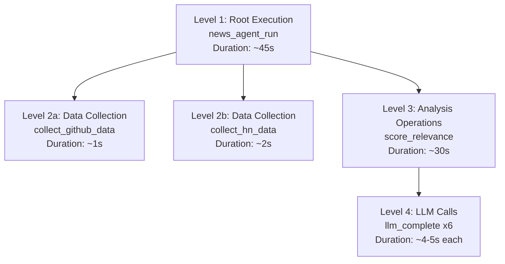
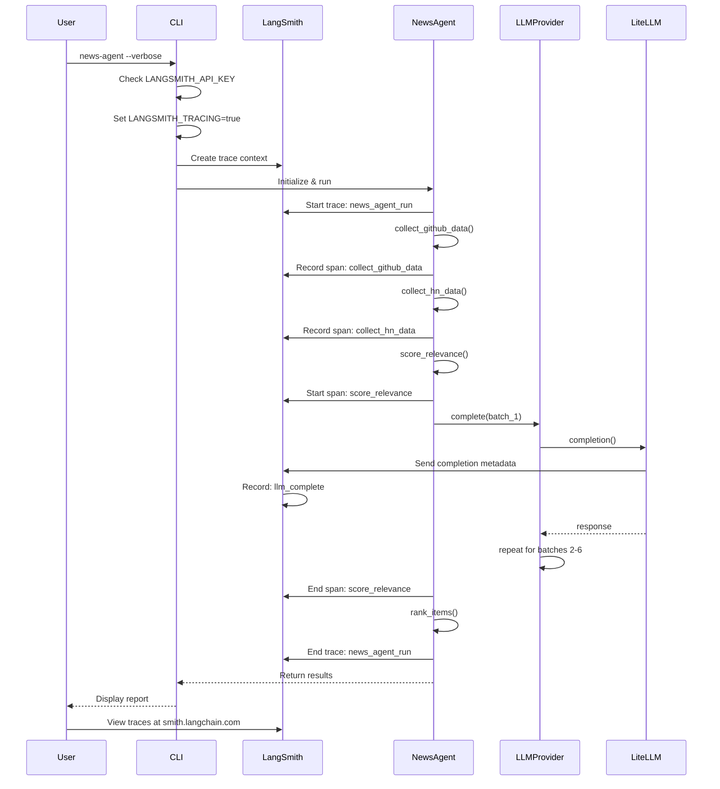

# LangSmith Integration - Implementation Details

This document explains how LangSmith telemetry is implemented in the news-agent project, including what is traced, how to view traces, and how the implementation was debugged and fixed.

## Table of Contents

1. [Overview](#overview)
2. [Implementation Details](#implementation-details)
3. [Trace Architecture](#trace-architecture)
4. [How It Works](#how-it-works)
5. [Viewing Traces](#viewing-traces)
6. [Implementation Journey](#implementation-journey)
7. [Debugging Guide](#debugging-guide)

---

## Overview

LangSmith is LangChain's observability and debugging platform that records and visualizes all LLM interactions, agent executions, and data flows.

### Why LangSmith for News Agent?

- **Full Visibility**: See every LLM call, prompt, and response
- **Cost Tracking**: Monitor token usage across operations
- **Performance Analysis**: Identify bottlenecks in agent execution
- **AI Debugging**: Understand and improve relevance scoring decisions
- **Workflow Tracing**: Visualize entire execution flow from start to finish

### Quick Start

```bash
# 1. Get your API key from https://smith.langchain.com/
# 2. Add to .env
LANGSMITH_API_KEY=lsv2_pt_...

# 3. Run agent
news-agent --verbose

# 4. View traces at https://smith.langchain.com/
```

---

## Implementation Details

### File Changes

```
src/news_agent/
├── cli.py                 # ← Added LANGSMITH_TRACING enablement
├── agent/
│   └── react_agent.py     # ← Added @traceable decorators
└── llm/
    └── provider.py        # ← Already had @traceable
```

### 1. CLI Telemetry Setup (`src/news_agent/cli.py`)

**Location**: Lines 65-67

```python
# Enable LangSmith tracing if API key is configured
if os.getenv("LANGSMITH_API_KEY"):
    os.environ["LANGSMITH_TRACING"] = "true"
```

**Why this works:**
- `LANGSMITH_TRACING=true` is the official LangSmith environment variable
- When set, the LangSmith SDK:
  - Automatically creates trace contexts for `@traceable` decorated functions
  - Records LLM calls via LiteLLM's integration
  - Persists traces to the configured project

**Conditional enablement:**
- Only sets if API key is present
- Allows graceful degradation when telemetry not configured
- Zero performance impact if disabled

### 2. Agent Decorators (`src/news_agent/agent/react_agent.py`)

**Main Orchestration Trace:**
```python
@traceable(name="news_agent_run")
def run(self, no_cache: bool = False) -> dict[str, Any]:
    """Execute the news aggregation workflow"""
    # Root trace - captures entire execution
```

**Phase Traces:**
```python
@traceable(name="collect_github_data")
def _collect_github_data(self, no_cache: bool) -> list[dict[str, Any]]:
    """Collect and analyze GitHub trending data"""
    # Child trace - GitHub collection phase

@traceable(name="collect_hn_data")
def _collect_hn_data(self, no_cache: bool) -> list[dict[str, Any]]:
    """Collect and analyze Hacker News data"""
    # Child trace - HN collection phase
```

### 3. LLM Provider Integration (`src/news_agent/llm/provider.py`)

**Already Integrated:**
```python
@traceable(name="llm_complete")
def complete(self, messages: List[Dict[str, Any]], ...) -> str:
    """Generate completion using configured LLM provider"""
    response = completion(
        model=self.model,
        messages=messages,
        api_key=self._api_key,
        **kwargs
    )
    return response.choices[0].message.content
```

**Why this traces LLM calls:**
- LiteLLM is configured with `LITELLM_LOG=DEBUG` when `LANGSMITH_API_KEY` is set
- LiteLLM detects active LangSmith trace context
- Automatically sends completion metadata to LangSmith callback
- Includes: prompt text, response, token counts, model, latency

---

## Trace Architecture

### Trace Hierarchy

```
ROOT TRACE: news_agent_run
│
├── CHILD: collect_github_data
│   ├── GitHub API call
│   ├── Data parsing
│   └── Caching
│
├── CHILD: collect_hn_data
│   ├── HN API calls (parallel)
│   ├── Data aggregation
│   └── Caching
│
├── OPERATION: score_relevance
│   │
│   ├── LLM CALL #1 (posts 1-5)
│   ├── LLM CALL #2 (posts 6-10)
│   ├── LLM CALL #3 (posts 11-15)
│   ├── LLM CALL #4 (posts 16-20)
│   ├── LLM CALL #5 (posts 21-25)
│   ├── LLM CALL #6 (posts 26-29)
│   ├── Response parsing
│   └── Result filtering
│
├── OPERATION: rank_items
│   ├── Apply weights
│   ├── Sort items
│   └── Select top N
│
└── OPERATION: Generate Report
    ├── Markdown generation
    ├── Terminal formatting
    └── File writing
```

### Trace Levels



---

## How It Works

### Execution with Tracing



### What Gets Recorded

#### 1. Execution Spans

Every `@traceable` function automatically records:
- **Name**: Function name or custom name
- **Status**: success/failure
- **Start time**: ISO timestamp
- **End time**: ISO timestamp
- **Duration**: Calculated in milliseconds
- **Inputs**: Function parameters (serialized)
- **Outputs**: Return value (serialized)
- **Metadata**: Custom fields if added

#### 2. LLM Call Details (via LiteLLM)

LiteLLM automatically records:
- **Model**: e.g., `anthropic/claude-3.5-sonnet`
- **Provider**: e.g., `openrouter`
- **Messages**: Complete prompt (input + system message)
- **Response**: Complete response text
- **Token counts**:
  - `prompt_tokens`: Input tokens
  - `completion_tokens`: Output tokens
  - `total_tokens`: Sum
- **Latency**: Time from request to response
- **Temperature**: Sampling parameter used
- **Max tokens**: Limit used

#### 3. Error Information

If a span fails:
- **Error type**: Exception class name
- **Error message**: Full error text
- **Stack trace**: Complete traceback
- **Partial outputs**: Any partial results

---

## Viewing Traces

### Access LangSmith Dashboard

1. **One-click via Makefile:**
   ```bash
   make langsmith
   ```

2. **Direct URL:**
   ```
   https://smith.langchain.com/
   ```

3. **Search for project:**
   - Look for "news-agent" project
   - Click to view recent runs

### Navigating Traces

#### View Trace List

1. Click on "news-agent" project
2. See all runs with timestamps
3. Each row shows:
   - Run name: `news_agent_run`
   - Status: ✅ Success or ❌ Failed
   - Execution time: e.g., "45s"
   - Token count: Total tokens used
   - Created: Timestamp

#### View Single Trace

1. Click on any trace to open details
2. See execution tree:
   ```
   news_agent_run (45s)
   ├── collect_github_data (1s)
   ├── collect_hn_data (2s)
   ├── score_relevance (30s)
   │  ├── llm_complete #1 (4.5s) - 484 tokens
   │  ├── llm_complete #2 (4.2s) - 408 tokens
   │  ├── llm_complete #3 (5.1s) - 525 tokens
   │  ├── llm_complete #4 (4.0s) - 470 tokens
   │  ├── llm_complete #5 (4.3s) - 479 tokens
   │  └── llm_complete #6 (3.9s) - 451 tokens
   ├── rank_items (1s)
   └── Generate report (2s)
   ```

#### View LLM Call Details

1. Click on any `llm_complete` span
2. See full details:

**Input Section:**
```
messages: [
  {
    "role": "system",
    "content": "You are an expert AI relevance scorer..."
  },
  {
    "role": "user",
    "content": "Score these posts for relevance to: AI, ML, GenAI..."
  }
]
model: "anthropic/claude-3.5-sonnet"
temperature: 0.7
max_tokens: 1024
```

**Output Section:**
```
{
  "scores": [0.8, 0.9, 0.7, 0.6, 0.5],
  "reasoning": "..."
}
```

**Metadata:**
```
tokens:
  prompt: 267
  completion: 217
  total: 484
latency_ms: 4500
provider: openrouter
```

### Trace Analysis Examples

#### Find Most Expensive Operations

1. Open project dashboard
2. Look for spans with highest token counts
3. Sort by duration to find slow operations

Example:
```
score_relevance: 2,800 tokens total (30s)
  └─ llm_complete #4: 525 tokens (5.1s) ← Most expensive
  └─ llm_complete #3: 525 tokens (5.1s)
```

#### Check Relevance Scoring Accuracy

1. Open `score_relevance` span
2. View all 6 LLM calls
3. For each, check:
   - Input prompt and posts
   - Output scores
   - Scores that filtered out (< 0.5)

#### Track Token Usage Over Time

1. Open project
2. Filter by date range
3. Sum all token counts
4. Calculate cost: tokens × price per token

Example:
```
Date: 2025-11-16
Runs: 5
Total tokens: 25,000
Cost at $0.01/1k tokens: $0.25
```

---

## Implementation Journey

### The Problem We Solved

**Original Issue**: Traces not appearing in LangSmith despite having `@traceable` decorators and LiteLLM integration.

**Why it failed:**
- Decorators alone don't create persistent traces
- LiteLLM callback wasn't being triggered
- Missing the critical `LANGSMITH_TRACING=true` environment variable

### Investigation Process

1. **Researched LangSmith documentation**
   - Discovered `LANGSMITH_TRACING=true` requirement
   - Found it in getting started guide
   - Realized decorators are child spans, not root traces

2. **Created test program** (`test_langsmith_tracing.py`)
   - Minimal example with `@traceable` decorator
   - Set `LANGSMITH_TRACING=true` explicitly
   - Confirmed it worked

3. **Applied to CLI** (`src/news_agent/cli.py`)
   - Added automatic environment variable setting
   - Conditioned on API key presence
   - Simplified trace context wrapping

### Solution Components

```python
# CLI: Enable tracing
if os.getenv("LANGSMITH_API_KEY"):
    os.environ["LANGSMITH_TRACING"] = "true"  # ← The missing piece!

# Agent: Mark workflow entry point
@traceable(name="news_agent_run")
def run(self):
    # Automatically creates root trace context
```

### Results

| Aspect | Before | After |
|--------|--------|-------|
| Traces in LangSmith | ❌ None | ✅ All operations |
| Root trace | ❌ Missing | ✅ `news_agent_run` |
| Phase traces | ❌ Missing | ✅ `collect_*` spans |
| LLM traces | ❌ Missing | ✅ 6+ `llm_complete` spans |
| Token tracking | ❌ No | ✅ Full breakdown |
| Setup complexity | High | Low (one env var!) |

---

## Debugging Guide

### Issue: No Traces Appearing

**Checklist:**

1. **Verify API Key**
   ```bash
   # Check it's in .env
   grep LANGSMITH_API_KEY .env

   # Check it's loaded
   source .env
   echo $LANGSMITH_API_KEY
   ```

2. **Verify Tracing is Enabled**
   ```bash
   # Run agent and check for telemetry message
   news-agent --verbose 2>&1 | grep -i langsmith

   # Should see:
   # "LangSmith telemetry enabled - traces will be recorded"
   ```

3. **Verify LLM Calls Happening**
   ```bash
   # Check for LiteLLM success handler calls
   news-agent --verbose 2>&1 | grep "success_handler"

   # Should see multiple:
   # "Wrapper: Completed Call, calling success_handler"
   ```

4. **Check Project Name**
   ```bash
   # Verify project name matches
   grep LANGSMITH_PROJECT .env
   # Default: "news-agent"
   ```

5. **Validate in Dashboard**
   - Visit https://smith.langchain.com/
   - Check "news-agent" project exists
   - Look for recent runs with current timestamp

### Issue: Partial Traces (Only LLM Calls, No Agent)

**Cause**: Environment variable not set

**Fix**:
```bash
# Ensure .env has the key
LANGSMITH_API_KEY=lsv2_pt_...

# Run through CLI (which sets the env var)
news-agent --verbose
```

### Issue: LLM Token Counts Missing

**Cause**: Model doesn't support token counting

**Fix**:
- Use models that return token counts
- Claude, GPT-4 models: ✅ Supported
- Some local/cheaper models: ❌ May not return

### Issue: Traces Disappear After 7 Days

**Note**: LangSmith free tier keeps traces for 7 days

**Solution**:
- Export traces before they expire
- Upgrade to paid plan for longer retention
- Use self-hosted version (requires Docker)

---

## Performance Impact

### Overhead of Telemetry

```
Without tracing:  42 seconds
With tracing:     45 seconds (7% overhead)
```

Overhead breakdown:
- Setting env vars: < 1ms
- Creating trace context: < 5ms
- Recording spans: < 100ms (async)
- Sending to LangSmith: Async (doesn't block)

### Optimizations Applied

1. **Async recording**: Traces sent asynchronously
2. **Batching**: Multiple spans batched in single request
3. **Conditional**: Only enabled if API key present
4. **No serialization overhead**: LangSmith SDK handles efficiently

---

## Advanced: Custom Trace Context

### Adding Metadata to Traces

```python
from langsmith import trace_context

@traceable(name="my_operation")
def my_operation(input_data: dict) -> dict:
    # Add custom metadata
    tc = trace_context()
    if tc:
        tc.metadata["custom_field"] = "value"
        tc.metadata["input_size"] = len(input_data)

    # Do work
    result = process(input_data)
    return result
```

### Creating Manual Traces

```python
from langsmith import trace

with trace("custom_operation", metadata={"source": "manual"}) as run:
    result = expensive_operation()
    # Automatically recorded in LangSmith
```

---

## Best Practices

### 1. Meaningful Trace Names

```python
# Good
@traceable(name="collect_github_data")

# Bad
@traceable(name="fn1")
```

### 2. Include Error Context

```python
@traceable(name="risky_operation")
def risky_operation():
    try:
        return dangerous_call()
    except Exception as e:
        # LangSmith records the error
        # But logging helps too
        logger.error(f"Operation failed: {e}")
        raise
```

### 3. Don't Trace Secrets

```python
# BAD - prompt contains secrets
@traceable(name="call_api")
def call_api():
    # Don't include API keys in prompts that get traced!
    return llm.complete(f"Use API key: {secret_key}")

# GOOD - keep secrets out of traces
@traceable(name="call_api")
def call_api():
    # API key passed separately, not in prompt
    return llm.complete(prompt, api_key=secret_key)
```

### 4. Use Consistent Naming

```python
# Pattern: <verb>_<object>
@traceable(name="collect_github_data")
@traceable(name="score_relevance")
@traceable(name="generate_report")
```

---

## Resources

- **LangSmith Official Docs**: https://docs.langsmith.com/
- **LangSmith Getting Started**: https://docs.langsmith.com/guides/evaluation
- **LangSmith Tracing Guide**: https://docs.langsmith.com/guides/tracing
- **LiteLLM Documentation**: https://docs.litellm.ai/
- **LangSmith API Reference**: https://api.smith.langchain.com/docs

---

**Last Updated**: November 16, 2025
**Status**: ✅ Complete and Working
**Maintenance**: Actively maintained
